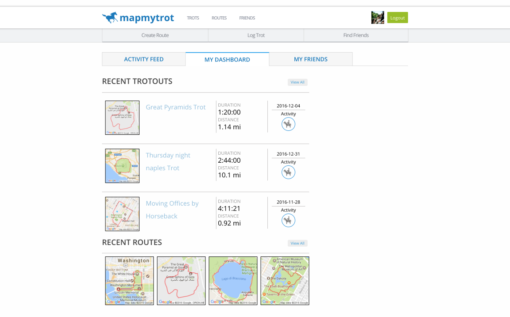

# MapMyTrot

[MapMyTrot](https://mapmytrot.herokuapp.com/#/)

MapMyTrot is a full-stack web application clone of MapMyRun. It utilizes Ruby on Rails on the backend, a PostgreSQL database, and React.js with a Redux architectural framework on the frontend.  

## Features & Implementation

### Creating and Rendering Routes

  The creation of routes utilizes google maps api to render the map. This allows users to create routes by clicking on the map. A search form allows the user to recenter the map to a new location. An event listener on the map records the bounds and encoded polylines that are saved to the database once the user hits submit. Using this data, thumbnails and maps are rendered to show users a snapshot of their routes.

  

### Friending

  MapMyTrot allows users to search for and add friends. On the database side, I have a joint table `friendships`. The user_id references which user requested the friendship, which I use to filter for requested friendships in my `FriendRequests` component. In the `MyFriends` component, I fetch the current users friends using a custom GET route that filters users through the joint table. My `FindFriends` component fetches users and then filters the users using the search value based on first name, last name and email.

  

### Dashboard/Activity Feed

  For my dashboard, I render a pull of the users three most recent routes and four most recent trots. The activity feed fetches all the activities of the current users friend organized by time created, including the user.

  On the backend, I have an `activity` joint table that has columns for `user_id`, `activatable_id`, and `activatable_type`. Through polymorphic association, activities are associated with routes and trots. When routes/trots are created, an activity is created through that association. The activities route serves back the activity with its comments and users nested beneath.

  

### Comments

  On my activity feed page, you can click on each activity to render a comment form and all comments associated with that activity. There is a `Comments` component that renders the comments form and list. My `ActivityComments` and `RouteDetail` component utilizes the `Comments` component in the activity feed. You can delete comments only if you are the author.
  Both routes and trots have many comments through a polymorphic association.

  

## Future Directions for the Project

In addition to the features already implemented, I plan to continue work on this project.  The next steps for MapMyTrot are outlined below.

### Direct Messaging

I plan on implementing direct messaging for users to make it an athletic social media site. I would have to learn how to use web sockets to accomplish this.

### Route Genius

Using Strava's API, I want to implement Route genius which will give you a suggested route given a set of parameters such as distance and starting location.
